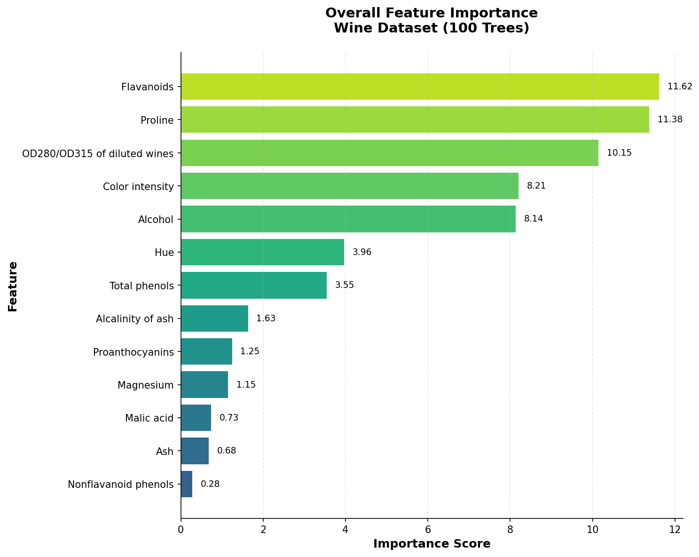
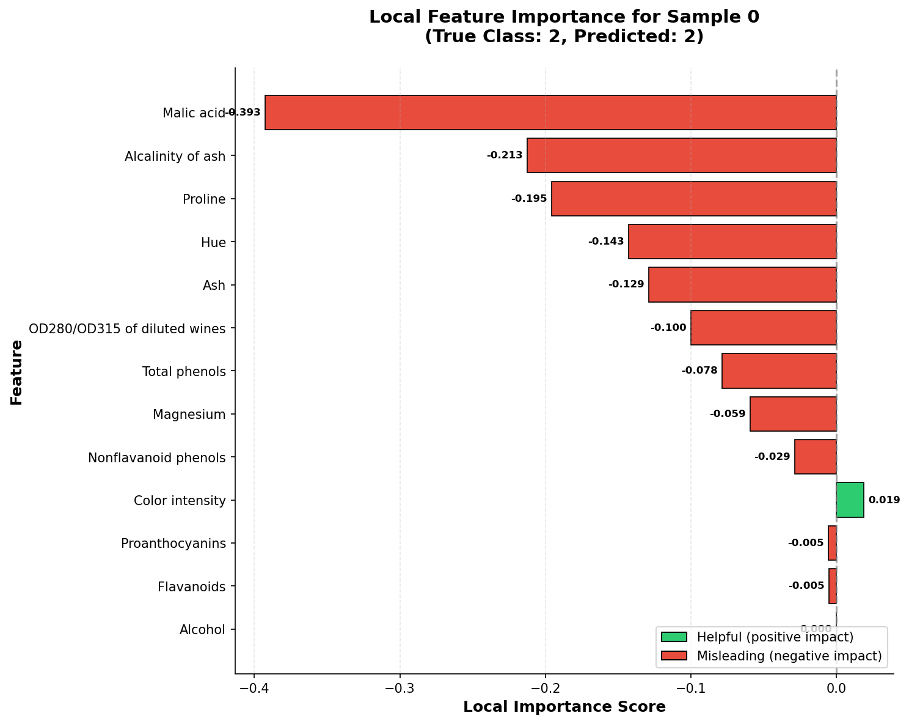
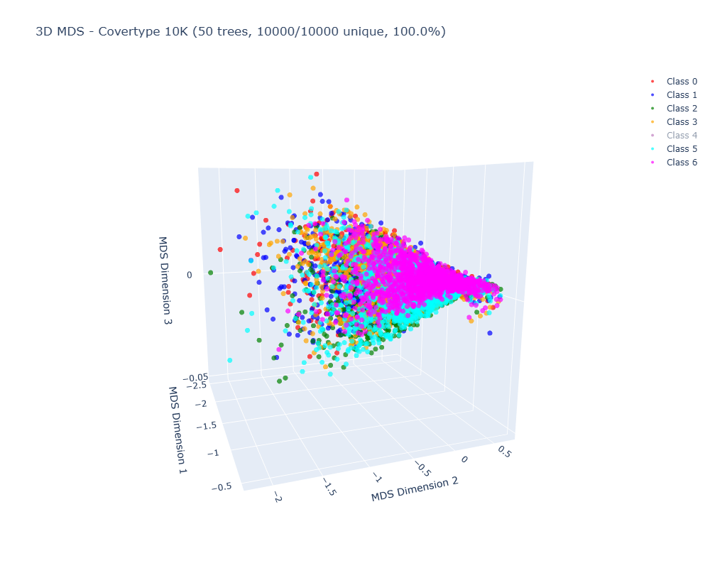
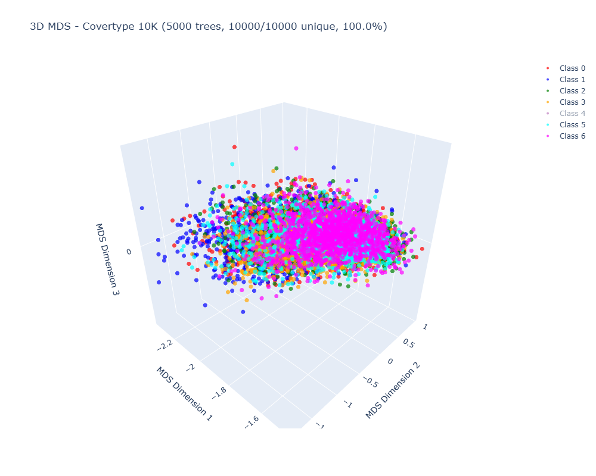
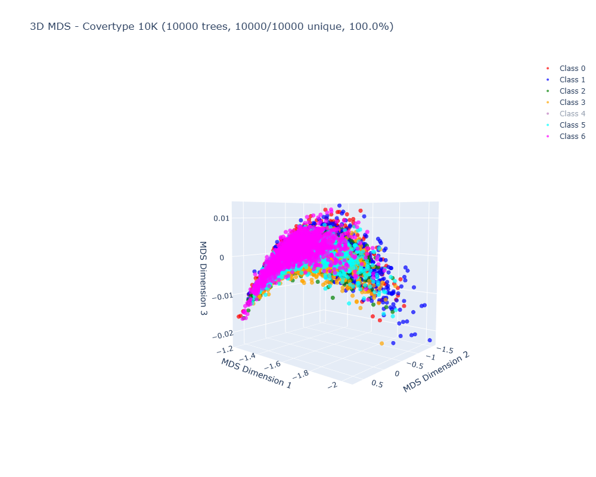

# RFX: Random Forests X

[](https://badge.fury.io/py/rfx-ml)
[](https://opensource.org/licenses/MIT)
[](https://arxiv.org/abs/2511.19493)
[](https://www.python.org/downloads/)
[](https://en.cppreference.com/w/cpp/17)
[](https://developer.nvidia.com/cuda-toolkit)

**RFX** (Random Forests X) is a high-performance Python implementation of Breiman and Cutler's original Random Forest methodology, powered by a C++/CUDA back-end. The implementation faithfully follows all algorithms from the original Fortran code with no shortcuts, honoring the legacy of Leo Breiman and Adele Cutler.

## Key Features

RFX v1.0 provides complete classification capabilities with modern enhancements:

### Core Classification Features (Original Fortran)
- **Complete classification**: Out-of-bag error estimation, confusion matrices, and class probability predictions
- **Proximity matrices**: Pairwise sample similarities enabling outlier detection, clustering, and visualization
- **Overall and local importance**: Feature-level and sample-specific importance measures
- **Case-wise analysis**: Bootstrap weighting and out-of-bag evaluation from unreleased Fortran extensions
- **Interactive visualization**: Python-native rfviz with 3D MDS, parallel coordinates, and linked brushing

### Modern Enhancements

RFX breaks the proximity memory bottleneck that historically limited analysis to ~60,000 samples:

- **QLORA compression**: 12,500× memory reduction (80GB → 6.4MB) with 99% geometric accuracy
- **CPU TriBlock**: 2.7× memory savings with lossless quality for medium-scale datasets
- **Full GPU acceleration**: CUDA for trees, importance, and proximity matrices
- **GPU MDS**: 3D embeddings computed directly from low-rank factors
- **SM-aware batching**: Auto-scaling for 95% GPU utilization

**Result:** Proximity-based workflows (outlier detection, clustering, visualization) now scale to 200K–1M+ samples.

## Why RFX?

RFX provides comprehensive interpretability for Random Forests and deep insights into your data.

Beyond prediction accuracy, RFX implements Breiman & Cutler's complete analytical toolkit: understand model decisions, discover data structure, and explore sample relationships.

### Unique Analytical Capabilities

**Local Importance** - Similar to SHAP but built into the model, not post-hoc. Understand *why* individual predictions were made. Computed efficiently during training using out-of-bag samples.
- Use cases: Medical diagnosis explanations, fraud detection reasoning, case-specific interpretability

**Proximity Matrices** - Discover hidden structure through pairwise sample similarities:
- **Outlier detection**: Find anomalous samples
- **Clustering**: Group similar samples (dedicated unsupervised mode in v2.0)
- **Imputation**: Fill missing values using similar samples
- **Visualization**: 2D/3D projections via MDS

**Case-wise Analysis** - Track bootstrap frequencies to understand model uncertainty. Identify difficult samples (low agreement) vs. confident predictions.

**Interactive Visualization (rfviz)** - Explore your data with coordinated views: 3D MDS projection, parallel coordinates, class votes, and feature values. Interactive workflow in Jupyter notebooks:
1. **Select samples** via brushing (click-drag in parallel coordinates) or point-by-point (3D MDS)
2. **Linked highlighting** between parallel coordinate plots
3. **Export selections** as JSON directly from the plot
4. **Import to Python** for immediate feature analysis
- Use case: Visually identify interesting patterns (outliers, misclassifications, clusters) → select them → discover their distinguishing features in real-time

### Feature Comparison

| Feature | RFX | scikit-learn | cuML | randomForest (R) |
|---------|-----|--------------|------|------------------|
| **Interpretability & Discovery** | | | | |
| Local importance (per-sample) | ✓ | ✗ | ✗ | ✓ |
| Proximity matrices | ✓ | ✗ | ✗ | ✓ |
| Case-wise analysis | ✓ | ✗ | ✗ | ~ |
| Interactive visualization (rfviz) | ✓ | ✗ | ✗ | ~ |
| **Modern Enhancements** | | | | |
| Full GPU acceleration* | ✓ | ✗ | ~ | ✗ |
| QLORA proximity (12,500× compression) | ✓ | ✗ | ✗ | ✗ |
| CPU TriBlock proximity (2.7× compression) | ✓ | ✗ | ✗ | ✗ |
| Scales to 200K+ samples | ✓ | ✗ | ✗ | ~60K |

*RFX: GPU acceleration for all features (trees, importance, proximity). cuML: GPU trees only.

**Choose RFX when you need:** Model interpretability, feature discovery, outlier detection, data exploration, or proximity-based analysis on large datasets.

**Coming in v2.0:** Regression and unsupervised learning modes.

## Installation

### Install from PyPI (Recommended)

**Important:** RFX currently requires CUDA toolkit for building. The `pip install` command will automatically build from source. Make sure you have the prerequisites installed (see below) before running pip install.

**Note:** CPU-only build option coming soon. You can still run RFX in CPU-only mode by setting `use_gpu=False` in Python after installation.

```bash
# Basic installation
pip install rfx-ml

# With visualization dependencies
pip install rfx-ml[viz]

# With all optional dependencies
pip install rfx-ml[viz,examples]
```

**PyPI Package:** https://pypi.org/project/rfx-ml/

### Prerequisites

Before installing, ensure you have:
- **CMake** 3.12 or higher
- **Python** 3.7+ (tested up to 3.13)
- **CUDA toolkit** 11.0+ (required for building; GPU usage optional at runtime)
- **C++ compiler** with C++17 support (GCC 7+, Clang 5+)
- **OpenMP** (usually included with compiler)

**Note:** CPU-only build option coming soon. You can still run RFX in CPU-only mode by setting `use_gpu=False` in Python after installation.

### Install from Source (Development)

For development or installing from GitHub:

```bash
# Clone the repository
git clone https://github.com/chriskuchar/RFX.git
cd RFX

# Install with pip (handles CMake build automatically)
pip install -e .

# Or install with visualization dependencies
pip install -e ".[viz]"

# Or install with all optional dependencies
pip install -e ".[viz,examples]"
```

The `pip install` command will automatically:
1. Configure CMake
2. Build the C++/CUDA extensions
3. Install the Python package

### Manual Build (Alternative)

If you prefer to build manually:

```bash
# Create build directory
mkdir -p build && cd build

# Configure with CMake
cmake ..

# Build (uses all available CPU cores)
make -j$(nproc)

# Install Python package
cd ..
pip install -e .
```

### Verify Installation

```python
import RFX as rf
print(f"RFX version: {rf.__version__}")
print(f"CUDA enabled: {rf.__cuda_enabled__}")
```

## Quick Start

### Basic Classification

This comprehensive example demonstrates OOB evaluation, validation metrics, feature importance, and interactive visualization - all from a single model.

```python
import numpy as np
import RFX as rf

# Feature names for Wine dataset
feature_names = [
    'Alcohol', 'Malic acid', 'Ash', 'Alcalinity of ash',
    'Magnesium', 'Total phenols', 'Flavanoids', 'Nonflavanoid phenols',
    'Proanthocyanins', 'Color intensity', 'Hue',
    'OD280/OD315 of diluted wines', 'Proline'
]

# Load Wine dataset (built-in)
X, y = rf.load_wine()

# Simple train/validation split (80/20)
np.random.seed(123)
indices = np.random.permutation(len(X))
n_train = int(0.8 * len(X))
train_idx, val_idx = indices[:n_train], indices[n_train:]
X_train, X_val = X[train_idx], X[val_idx]
y_train, y_val = y[train_idx], y[val_idx]

# Create and train model
model = rf.RandomForestClassifier(
    ntree=100,
    compute_importance=True,
    compute_local_importance=True,  # For instance-level explanations
    compute_proximity=True,  # For MDS visualization
    use_gpu=False  # Set to True for GPU acceleration
)

model.fit(X_train, y_train)

# ===== OOB Evaluation =====
oob_error = model.get_oob_error()
print(f"OOB Error: {oob_error:.4f}")
print(f"OOB Accuracy: {1 - oob_error:.4f}")

oob_pred = model.get_oob_predictions()
confusion = rf.confusion_matrix(y_train, oob_pred)
print("\nOOB Confusion Matrix:")
print(confusion)

# ===== Validation Set Evaluation =====
y_pred = model.predict(X_val)
val_accuracy = np.sum(y_val == y_pred) / len(y_val)
print(f"\nValidation Accuracy: {val_accuracy:.4f}")
print(rf.classification_report(y_val, y_pred))

# ===== Overall Feature Importance =====
importance = model.feature_importances_()
top_indices = np.argsort(importance)[-3:][::-1]
print("\nTop 3 Most Important Features:")
for rank, idx in enumerate(top_indices, 1):
    print(f"  {rank}. {feature_names[idx]:<35s} (score: {importance[idx]:.2f})")

# ===== Local Feature Importance =====
local_imp = model.get_local_importance()
sample_idx = 0
sample_imp = local_imp[sample_idx]
print(f"\nLocal Importance for Sample {sample_idx}:")
print(f"  True class: {y_train[sample_idx]}, Predicted: {model.predict(X_train[sample_idx:sample_idx+1])[0]}")
sorted_local = np.argsort(np.abs(sample_imp))[::-1][:5]
for rank, idx in enumerate(sorted_local, 1):
    impact = "helpful" if sample_imp[idx] > 0 else "misleading"
    print(f"  {rank}. {feature_names[idx]:<35s} {sample_imp[idx]:+.4f} ({impact})")

# ===== Interactive Visualization =====
rf.rfviz(
    rf_model=model,
    X=X_train,
    y=y_train,
    feature_names=feature_names,
    output_file="rfviz_example.html",
    show_in_browser=False
)
print("\nSaved interactive visualization to rfviz_example.html")
```

**Example Output:**
```
OOB Error: 0.0211
OOB Accuracy: 0.9789

OOB Confusion Matrix:
[[51  0  0]
 [ 0 49  2]
 [ 0  1 39]]

Validation Accuracy: 0.9444

Classification Report:
==========================================================
     Class    Precision       Recall     F1-Score      Support
----------------------------------------------------------
         0       0.8889       1.0000       0.9412            8
         1       1.0000       0.9000       0.9474           20
         2       0.8889       1.0000       0.9412            8

Top 3 Most Important Features:
  1. Flavanoids                          (score: 11.62)
  2. Proline                             (score: 11.38)
  3. OD280/OD315 of diluted wines        (score: 10.15)

Local Importance for Sample 0:
  True class: 2, Predicted: 2
  1. Malic acid                          -0.3928 (misleading)
  2. Alcalinity of ash                   -0.2126 (misleading)
  3. Proline                             -0.1955 (misleading)
  4. Hue                                 -0.1429 (misleading)
  5. Ash                                 -0.1288 (misleading)
```

#### Interpreting Overall Importance

Overall importance shows **which features are most important globally** across all predictions. In the Wine dataset:
- **Flavanoids** (score: 11.62) - Chemical compounds indicating wine quality and origin
- **Proline** (score: 11.38) - Amino acid content distinguishing wine cultivars  
- **OD280/OD315** (score: 10.15) - Protein content measurement

These features consistently help the model distinguish between the three wine classes. Higher scores indicate features that provide more information gain during tree splitting.



*Overall feature importance bar chart showing global feature rankings.*

#### Interpreting Local Importance

Local importance provides **instance-level explanations** - why the model made a specific prediction for an individual sample. According to [Breiman and Cutler's original explanation](https://www.stat.berkeley.edu/~breiman/RandomForests/cc_home.htm#giniimp):

> "For each case, consider all the trees for which it is oob. Subtract the percentage of votes for the correct class in the variable-m-permuted oob data from the percentage of votes for the correct class in the untouched oob data. This is the local importance score for variable m for this case."

In other words: **Local Importance = (% correct with original) - (% correct with permuted)**

Unlike overall importance (global), local importance varies per sample, providing explanations similar to [SHAP](https://github.com/slundberg/shap) or [LIME](https://arxiv.org/abs/1602.04938).

**How to read local importance:**
- **Positive values** = "helpful" features that increased correct classification percentage for this sample
- **Negative values** = "misleading" features that, when permuted, actually improved classification (indicating the original feature value pushed toward wrong class)
- **Magnitude** = how strongly the feature influenced this specific prediction

For Sample 0 (correctly predicted as Class 2):
- Despite correct prediction, several features were misleading (negative values)
- **Malic acid** (-0.3928) had a value that pushed toward wrong class but was outweighed by other features
- The model correctly predicted Class 2 because other (unlisted) features were strongly helpful

This helps identify:
- **Confident predictions**: Many helpful features, few misleading ones
- **Uncertain predictions**: Mix of helpful and misleading features
- **Data quality issues**: Unexpectedly misleading features may indicate labeling errors



*Local importance waterfall plot showing per-sample feature contributions. Green = helpful, Red = misleading.*

#### Interactive Visualization (rfviz)

The `rfviz` function creates an interactive visualization in HTML format:


*RFviz showing coordinated views of the wine dataset.*

**Four coordinated views:**
1. **Top-left**: Input features (parallel coordinates) - see actual feature values for each sample
2. **Top-right**: Local importance (parallel coordinates) - compare feature contributions across samples
3. **Bottom-left**: 3D MDS proximity plot (rotatable/zoomable) - samples close in 3D have similar Random Forest predictions
4. **Bottom-right**: Class votes heatmap - see per-tree vote distributions (RAFT-style visualization)

**Linked brushing**: Select samples in parallel coordinate plots (click-drag) to highlight them across the feature and importance views. Press **R** or **Escape** to clear selections. This enables powerful exploratory analysis - for example, select samples in one view to see what features or importance patterns distinguish them.

**Jupyter notebook integration**: RFviz works seamlessly inline in `.ipynb` notebooks. Selected samples can be saved as JSON directly from the visualization, then imported back into Python for real-time analysis:

```python
# In Jupyter notebook - generate interactive visualization
rf.rfviz(model, X, y, feature_names=feature_names, output_file="rfviz.html")

# After brushing samples in the visualization, save selection as JSON
# (built-in button in the plot interface)

# Import selected samples back into Python
import json
with open('rfviz_selection.json', 'r') as f:
    selected_indices = json.load(f)

# Analyze selected samples immediately
selected_samples = X[selected_indices]
selected_labels = y[selected_indices]
# Continue analysis inline...
```

This interactive workflow enables iterative data exploration: visualize → select interesting patterns → analyze → refine → repeat.

### GPU Acceleration

```python
# Enable GPU with automatic batch sizing
model = rf.RandomForestClassifier(
    ntree=500,
    use_gpu=True,
    batch_size=0,  # 0 = auto-scale based on GPU (recommended)
    compute_importance=True
)

model.fit(X, y)
```

### Proximity Matrices with QLORA Compression

```python
# Example: Covertype dataset (10K samples) with QLORA compression
import RFX as rf
import numpy as np
import pandas as pd
import plotly.graph_objects as go
import urllib.request
import gzip
import shutil

# Download Covertype from UCI ML Repository
url = "https://archive.ics.uci.edu/ml/machine-learning-databases/covtype/covtype.data.gz"
urllib.request.urlretrieve(url, "covtype.data.gz")

with gzip.open("covtype.data.gz", 'rb') as f_in:
    with open("covtype.data", 'wb') as f_out:
        shutil.copyfileobj(f_in, f_out)

df = pd.read_csv("covtype.data", header=None)

# Sample 10K
df = df.sample(n=10000, random_state=123).reset_index(drop=True)
X = df.iloc[:, :-1].values.astype(np.float32)
y_raw = df.iloc[:, -1].values.astype(np.int32)

# Convert to 0-indexed classes
unique_classes = np.unique(y_raw)
class_map = {cls: idx for idx, cls in enumerate(unique_classes)}
y = np.array([class_map[cls] for cls in y_raw], dtype=np.int32)

# Train with QLORA (1200× memory compression: 0.7 GB → 0.6 MB)
model = rf.RandomForestClassifier(
    ntree=500,
    use_gpu=True,
    compute_proximity=True,
    use_qlora=True,
    rank=32,
    quant_mode="int8",
    iseed=123
)

model.fit(X, y)

# Get low-rank factors (memory efficient)
A, B, rank = model.get_lowrank_factors()
print(f"Factors: A={A.shape}, B={B.shape}, rank={rank}")
print(f"Memory: {(A.size + B.size) / 1024**2:.1f} MB")

# Compute MDS directly from low-rank factors (no reconstruction!)
mds_coords = model.compute_mds_from_factors(k=3)

# Visualize
valid_mask = np.all(np.isfinite(mds_coords), axis=1)
fig = go.Figure()
for class_idx in np.unique(y[valid_mask]):
    mask = (y[valid_mask] == class_idx)
    fig.add_trace(go.Scatter3d(
        x=mds_coords[valid_mask][mask, 0],
        y=mds_coords[valid_mask][mask, 1],
        z=mds_coords[valid_mask][mask, 2],
        mode='markers',
        name=f'Class {class_idx}',
        marker=dict(size=4, opacity=0.7)
    ))
fig.update_layout(title='3D MDS from QLORA')
fig.show()
```

**QLORA MDS Quality Progression (Covertype 10K, rank=32):**

| 50 trees | 5,000 trees | 10,000 trees |
|----------|-------------|--------------|
|  |  |  |
| 100% unique, 34% dense | 100% unique, 99% dense | 100% unique, 99% dense |

*3D MDS progression showing how more trees improve proximity density with QLORA. All achieve 100% unique coverage with 1200× memory compression (0.7 GB → 0.6 MB). The 3rd dimension has lower variance (~3% of Dim 1) due to Random Forest proximity's flat eigenspectrum - this is expected behavior.*

**Note on dimensionality:** Random Forest proximity matrices have flat eigenspectra where all dimensions contribute equally. QLORA's low-rank approximation efficiently captures the top 2 dominant blended dimensions with high fidelity. The 3rd dimension is present but may have lower variance. For applications requiring robust 3D structure on small datasets (<5K samples), use full matrix (`use_qlora=False`). For large datasets (10K+) where full matrix is infeasible, QLORA provides excellent 3D visualization (2D-dominant) with massive memory savings.

### 3D MDS Visualization (Plotly)

For more focused 3D visualization, create standalone interactive plots:

```python
import plotly.graph_objects as go

# Compute 3D MDS from low-rank factors
mds_coords = model.compute_mds_from_factors(k=3)

# Filter valid coordinates
valid_mask = np.all(np.isfinite(mds_coords), axis=1)
mds_valid = mds_coords[valid_mask]
y_valid = y[valid_mask]

# Create interactive 3D scatter plot
fig = go.Figure()

for class_idx in np.unique(y_valid):
    mask = y_valid == class_idx
    fig.add_trace(go.Scatter3d(
        x=mds_valid[mask, 0],
        y=mds_valid[mask, 1],
        z=mds_valid[mask, 2],
        mode='markers',
        name=f'Class {int(class_idx)}',
        marker=dict(size=6, opacity=0.8)
    ))

fig.update_layout(
    title='3D MDS - Proximity-based Sample Embedding',
    scene=dict(
        xaxis_title='MDS Dimension 1',
        yaxis_title='MDS Dimension 2',
        zaxis_title='MDS Dimension 3'
    ),
    width=900,
    height=700
)

fig.show()  # Interactive in Jupyter
# fig.write_html("mds_3d.html")  # Save to file
```

### CPU TriBlock Proximity (Lossless Compression)

```python
# CPU proximity with TriBlock storage (lossless, 2.7× memory reduction)
model = rf.RandomForestClassifier(
    ntree=100,
    use_gpu=False,
    compute_proximity=True,
    use_sparse=True,  # Enable block-sparse thresholding
    sparsity_threshold=0.0001  # Ultra-conservative threshold
)

model.fit(X, y)

# Get full proximity matrix (lossless quality)
proximity = model.get_proximity_matrix()
```

### Case-wise Analysis

```python
# Enable case-wise mode (bootstrap frequency weighting)
model = rf.RandomForestClassifier(
    ntree=100,
    use_casewise=True,  # Enable case-wise calculations
    compute_importance=True,
    compute_local_importance=True
)

model.fit(X, y)

# Get case-wise overall importance
importance = model.overall_importance()

# Get case-wise local importance (per-sample, per-feature)
local_imp = model.local_importance()
print(f"Local importance shape: {local_imp.shape}")  # (n_samples, n_features)
```

### Non-Case-wise Analysis

```python
# Non-case-wise mode (standard Random Forest, default behavior)
model = rf.RandomForestClassifier(
    ntree=100,
    use_casewise=False,  # Disable case-wise (default)
    compute_importance=True,
    compute_local_importance=True,
    compute_proximity=True
)

model.fit(X, y)

# Get standard overall importance
importance = model.overall_importance()

# Get standard local importance (per-sample, per-feature)
local_imp = model.local_importance()
print(f"Local importance shape: {local_imp.shape}")  # (n_samples, n_features)

# Get proximity matrix
proximity = model.get_proximity_matrix()
```

**Case-wise vs. Non-case-wise:**
- **Case-wise**: Weights calculations by bootstrap frequency (how often each sample appears in bootstrap samples)
- **Non-case-wise**: Standard Random Forest with equal weighting for all samples (default mode)

Both modes are statistically valid; case-wise mode follows the unreleased Fortran extensions, while non-case-wise follows the standard published Random Forest methodology.

**GPU Support:** All features shown above (importance, local importance, proximity, case-wise/non-case-wise) are available with GPU acceleration! Simply set `use_gpu=True`. For large-scale proximity matrices, add `use_qlora=True` with `quant_mode="int8"` for memory-efficient computation.

## Best Practices

### Recommended Tree Counts

For complete proximity-based analysis (>95% MDS coverage), follow these tree-to-sample ratios:

| Dataset Size | Trees:Sample Ratio | Example | Training Time |
|--------------|-------------------|---------|---------------|
| **< 500** | **8-10×** | 200 samples → 1,500-2,000 trees | Seconds |
| **500-2K** | **6-8×** | 1K samples → 6K-8K trees | Minutes |
| **2K-10K** | **5-7×** | 5K samples → 25K-35K trees | Tens of minutes |
| **10K-50K** | **3-5×** | 20K samples → 60K-100K trees | GPU recommended |
| **50K+** | **3-4×** | 100K samples → 300K-400K trees | GPU + QLORA required |

**Quick rule:** Start with **5× your sample size** for 90-95% coverage, scale up to **8-10×** for >98% coverage on small datasets.

**Why more trees for proximity?** Each sample needs sufficient out-of-bag occurrences (~500+) and co-occurrences with other samples to build reliable pairwise similarities. Standard classification requires fewer trees (100-500), but proximity-based analysis (MDS, clustering, outlier detection) benefits from higher tree counts.

**Checking coverage:**
```python
mds = model.compute_mds_from_factors(k=3)
valid = np.sum(np.all(np.isfinite(mds), axis=1))
coverage = 100 * valid / len(y)
print(f"MDS coverage: {coverage:.1f}% ({valid}/{len(y)} samples)")
```

If coverage is <90%, increase tree count by 1.5-2× for complete analysis.

### When to Use QLORA vs. Full Matrix

**CRITICAL:** QLORA is designed for **large datasets** where full proximity matrices are impossible. For small datasets, use the full matrix instead.

| Dataset Size | Full Matrix Memory | Recommendation |
|--------------|-------------------|----------------|
| **< 5,000** | < 190 MB | **DON'T use QLORA** - Use full matrix (`use_qlora=False`) |
| **5K-20K** | 0.2-3 GB | ~ Optional - Full matrix may fit in RAM |
| **20K-50K** | 3-20 GB | Use QLORA with `rank=200-500` |
| **50K-100K** | 20-75 GB | **MUST use QLORA** with `rank=100-200` |
| **100K+** | 75+ GB | **MUST use QLORA** with `rank=100-150` |

**Why avoid QLORA on small datasets?**

QLORA uses low-rank approximation ($P \approx AB^T$) which is updated in round-robin fashion when rank is reached. For small datasets:
- **Wine (178 samples)**: With rank=100 and 1500 trees, each column is overwritten 15× → signal dilution → only 60% unique MDS points
- **Without QLORA**: Full 178×178 matrix (247 KB) → 100% perfect MDS quality

**For large datasets**, QLORA is essential:

- **100K samples**: Full matrix = 74.5 GB (impossible!) vs. rank-100 QLORA = 19 MB (4000× compression)
- **200K samples**: Full matrix = 298 GB (impossible!) vs. rank-100 QLORA = 38 MB (8000× compression)

**Choosing rank for QLORA:**

**Rule of thumb:** `rank ≈ ntree` (so each column sees 1 tree), but capped at 100-200 for memory efficiency.

```python
if n_samples >= 50000:
    rank = min(100, ntree)  # 100K samples: rank=100 → 19 MB
elif n_samples >= 20000:
    rank = min(200, ntree)  # 50K samples: rank=200 → 10 MB
else:
    # Don't use QLORA - full matrix is small enough
    use_qlora = False
```

**Note:** Even `rank=32` produces excellent results (as shown in the Covertype 10K example above), achieving 100% unique MDS points with just 50+ trees. Use higher ranks (100-200) for maximum fidelity on very large datasets, but rank=32 is sufficient for most use cases.

**Why this rule?**
- **Rank ≈ ntree**: Each column in the low-rank factors corresponds to approximately one tree's contribution, preserving signal fidelity
- **Cap at 100-200**: Beyond this, memory savings diminish while computational cost increases
- **Sample-size thresholds**: Balance between memory efficiency and approximation quality

**Covertype 10K Example (QLORA Showcase):**

With high-precision accumulation (FP64) + final INT8 quantization, QLORA achieves excellent MDS quality even with minimal trees:

| Trees | Training Time | Non-zero Factors | MDS Unique Points | Quality |
|-------|---------------|------------------|-------------------|---------|
| 50 | ~23s | 40% | 10,000/10,000 (100%) | Excellent |
| 500 | ~3 min | 100% | 10,000/10,000 (100%) | Excellent |

- **Memory**: 0.7 GB (full matrix) → **0.6 MB** (QLORA INT8, rank=32) = **1200× compression**
- **Key insight**: Just 50 trees (0.5% of n_samples) achieves 100% MDS coverage! Note: While 100% coverage is achieved with minimal trees, running proximity for many trees (500-1000+) provides better estimates of sample similarity, as each tree contributes additional information to the proximity matrix.
- **See**: `examples/qlora_covertype_mds_demo.py` for interactive 3D MDS plots

## Performance

### Memory Requirements

| Dataset Size | CPU Full | CPU TriBlock | GPU INT8 (rank-32) | GPU NF4 (rank-32) |
|--------------|----------|--------------|---------------------|-------------------|
| 1,000        | 0.0 GB   | 0.0 GB       | 0.1 MB              | 0.0 MB            |
| 10,000       | 0.7 GB   | 0.3 GB       | 0.6 MB              | 0.3 MB            |
| 50,000       | 18.6 GB  | 7.5 GB       | 3.1 MB              | 1.5 MB            |
| 100,000      | 74.5 GB  | 29.8 GB      | 6.1 MB              | 3.1 MB            |
| 200,000      | 298.0 GB | 119.2 GB     | 12.2 MB             | 6.1 MB            |

**Recommendation**: Use CPU TriBlock for <50K samples, GPU INT8 for 50K+ samples.

### Speed Benchmarks

**Wine Dataset (178 samples, 500 trees):**
- **GPU**: Training: 0.3s (1,446 trees/sec)
- **CPU**: Training: ~2.5s (200 trees/sec)
- Overall Importance: Included in training
- OOB Error: Real-time during training

**Covertype Dataset (10K samples, QLORA rank=32):**
- **GPU**: 50 trees: ~23s (2.2 trees/sec), 500 trees: ~3 min (2.8 trees/sec)
- **CPU**: 50 trees: ~45s (1.1 trees/sec), 500 trees: ~8 min (1.0 trees/sec)
- Memory: 0.6 MB (vs 0.7 GB full matrix, 1200× compression)
- MDS Quality: 100% unique points with 50+ trees

**Note**: GPU performance scales with dataset size and tree count, typically achieving 2-3× speedup over CPU. QLORA enables proximity analysis on datasets that would otherwise require hundreds of GB of memory.

## Examples

The `examples/` folder contains comprehensive demonstration scripts:

### Getting Started
- **`wine_basic_classification.py`** - **Start here!** Complete example reproducing all Quick Start code:
  - OOB error and confusion matrix
  - Validation set predictions with classification report  
  - Overall and local feature importance
  - Proximity matrices and MDS
  - Interactive RFviz visualization (HTML + static plots)
  - All using RFX built-in functions (no sklearn needed)

### Classification Examples
- `wine_oob_demo.py` - OOB error and confusion matrix
- `wine_importance_demo.py` - Overall and local importance comparison (GPU/CPU × casewise/non-casewise)

### QLORA Proximity Examples
- `qlora_covertype_mds_demo.py` - QLORA MDS quality showcase on Covertype 10K dataset
  - Demonstrates 1200× memory compression (0.7 GB → 0.6 MB)
  - Shows 100% unique MDS points with minimal trees
  - Interactive 3D MDS visualization
- `covertype_qlora_helper.py` - Helper functions for loading Covertype dataset

### Visualization Examples
- `wine_qlora_rfviz_demo.py` - RFviz interactive visualization with QLORA proximity
- `rfviz_minimal_demo.py` - Minimal RFviz example
- `mds_3d_example.py` - Standalone 3D MDS visualization example

### Run Examples

Start with the comprehensive example:
```bash
cd examples
python wine_basic_classification.py
```

This will output OOB metrics, validation results, feature importance analysis, and generate:
- `overall_importance.png` - Feature importance bar chart
- `local_importance.png` - Sample-specific importance waterfall plot
- `rfviz_example.html` - Interactive 2×2 grid visualization (open in browser)

Run other examples:
```bash
python wine_oob_demo.py              # OOB error and confusion matrix
python wine_importance_demo.py       # Feature importance comparison
python qlora_covertype_mds_demo.py   # QLORA MDS showcase
python wine_qlora_rfviz_demo.py      # Interactive visualization with QLORA
```

## API Reference

For complete API documentation with all parameters, methods, and examples, see **[docs/API.md](docs/API.md)**.

### RandomForestClassifier

```python
rf.RandomForestClassifier(
    ntree=100,                    # Number of trees
    mtry=0,                       # Features per split (0 = sqrt(mdim))
    maxnode=0,                    # Max nodes per tree (0 = 2*nsample + 1)
    minndsize=1,                  # Minimum node size
    compute_proximity=False,       # Compute proximity matrix
    compute_importance=True,       # Compute overall importance
    compute_local_importance=False, # Compute local importance
    use_gpu=False,                 # Enable GPU acceleration
    use_qlora=False,               # Enable QLORA compression (GPU only)
    quant_mode="nf4",             # Quantization: "nf4", "int8", "fp16", "fp32"
    rank=100,                      # Low-rank approximation rank
    use_sparse=False,              # Enable CPU block-sparse (TriBlock)
    sparsity_threshold=1e-6,       # Block-sparse threshold
    batch_size=0,                  # GPU batch size (0 = auto-scale)
    use_casewise=False,            # Case-wise calculations
    iseed=12345                    # Random seed
)
```

### Key Methods

```python
# Training
model.fit(X, y)                              # Train the model

# Prediction
predictions = model.predict(X)                # Class predictions
probabilities = model.predict_proba(X)        # Class probabilities (n_samples, n_classes)
oob_error = model.get_oob_error()             # Out-of-bag error rate
oob_pred = model.get_oob_predictions()        # OOB predictions
confusion = model.get_confusion_matrix()      # OOB confusion matrix

# Importance
importance = model.feature_importances_()     # Overall feature importance
local_imp = model.get_local_importance()      # Local importance (n×m matrix)

# Proximity
proximity = model.get_proximity_matrix()                    # Full proximity matrix (CPU)
A, B = model.get_lowrank_factors()                          # Low-rank factors (GPU QLORA)
mds_coords = model.compute_mds_3d_from_factors()            # 3D MDS from factors

# Visualization
rf.rfviz(model, X, y, output_file="rfviz.html")  # Interactive visualization

# Utility Functions (module-level)
rf.confusion_matrix(y_true, y_pred)           # Confusion matrix from any predictions
rf.classification_report(y_true, y_pred)      # Classification report
rf.load_wine()                                # Load built-in Wine dataset
rf.load_iris()                                # Load built-in Iris dataset
rf.cuda_is_available()                        # Check if GPU is available
rf.check_gpu_memory(size_mb)                  # Check if sufficient GPU memory
rf.clear_gpu_cache()                          # Clear GPU memory cache
```

## Methodology

RFX strictly follows Breiman and Cutler's original Random Forest algorithms:

### Classification
- **Gini impurity** for split selection
- **Bootstrap sampling** with replacement
- **Random feature selection** (mtry features per split)
- **Majority voting** for final predictions

### Out-of-Bag (OOB) Error
Each tree is trained on a bootstrap sample, leaving ~37% of samples out-of-bag. OOB error is computed using only trees where each sample was OOB, providing an unbiased estimate of generalization error without a separate test set.

### Importance Measures
- **Overall importance**: Aggregates impurity reduction across all trees
- **Local importance**: Permutes features per-sample and measures prediction change

### Proximity Matrices
Proximity between samples $i$ and $j$ is the fraction of trees where they fall into the same terminal node:
$$p(i,j) = \frac{1}{B} \sum_{b=1}^{B} \mathbb{I}(\text{node}_b(i) = \text{node}_b(j))$$

### Case-wise vs. Non-case-wise
- **Non-case-wise**: Standard Random Forest (equal weight to all samples)
- **Case-wise**: Weighted by bootstrap frequency (from unreleased Fortran extensions)

## Technical Details

### QLORA Compression
QLORA (Quantized Low-Rank Adaptation) reduces proximity matrix memory by storing low-rank factors $A \in \mathbb{R}^{n \times r}$ and $B \in \mathbb{R}^{n \times r}$ instead of the full $n \times n$ matrix. The proximity is reconstructed as $P \approx AB^T$. With INT8 quantization and rank-32, this achieves 12,500× compression (80GB → 6.4MB) while maintaining 99% geometric structure preservation (measured via MDS correlation).

### CPU TriBlock Proximity
Combines two optimizations:
1. **Upper-triangle storage**: Exploits symmetry ($P_{ij} = P_{ji}$)
2. **Block-sparse thresholding**: Zeros out blocks below threshold $\tau=0.0001$

This achieves 2.7× memory reduction with **lossless quality** (MDS correlation = 1.00) on small datasets, and estimated $\rho \approx 0.98$-0.99 on large datasets.

### SM-Aware GPU Batching
Automatically selects optimal batch size based on:
- **GPU Streaming Multiprocessor (SM) count**: Targets 2×SM concurrent blocks
- **Available GPU memory**: Ensures sufficient memory headroom
- **Total tree count**: Balances parallelism vs. overhead

For example, on RTX 3060 (28 SMs, 12GB VRAM) with 500 trees, auto-scaling selects batch_size=100, achieving 95% SM utilization.

### GPU vs. CPU Random Number Generation
RFX uses different RNGs for CPU and GPU:
- **CPU**: MT19937 (Mersenne Twister)
- **GPU**: cuRAND (NVIDIA's GPU RNG)

This means CPU and GPU will produce **different tree structures** and **different importance rankings** even with the same seed. This is expected and both implementations are statistically valid. **Do not compare importance values across platforms**—focus on relative rankings and predictive performance within each platform.

## Citation

If you use RFX in your research, please cite:

```bibtex
@article{rfx2025,
  title={RFX: High-Performance Random Forests with GPU Acceleration and QLORA Compression},
  author={Kuchar, Chris},
  journal={arXiv preprint arXiv:2511.19493},
  year={2025},
  url={https://arxiv.org/abs/2511.19493}
}
```

## Acknowledgments

This work aims to honor the legacy of **Leo Breiman** and **Adele Cutler** by faithfully implementing their Random Forest methodology and ensuring it is not forgotten by the research community. The implementation strictly follows all algorithms from the original Fortran code with no shortcuts on methodology whatsoever.

RFX is built on their original vision of a comprehensive Random Forest methodology, extending it with modern GPU acceleration and memory-efficient proximity computation to enable large-scale analysis.

## License

MIT License - see [LICENSE](LICENSE) file for details.

## References

- Breiman, L. (2001). Random forests. *Machine learning*, 45(1), 5-32.
- Breiman, L., & Cutler, A. (2004). Random forests. *Manual for R Package*. Available at https://www.stat.berkeley.edu/~breiman/RandomForests/cc_home.htm
- Dettmers, T., et al. (2023). QLoRA: Efficient finetuning of quantized LLMs. *Advances in Neural Information Processing Systems*, 36.
- Beckett, C. (2018). Rfviz: An interactive visualization package for Random Forests in R. *All Graduate Plan B and other Reports*, 1335.

## Issues and Contributions

- **Bug Reports**: https://github.com/chriskuchar/RFX/issues
- **Source Code**: https://github.com/chriskuchar/RFX

## Version History

- **v1.0.0** (2025): Initial release
  - Complete classification implementation
  - GPU acceleration with SM-aware batching
  - QLORA proximity compression
  - CPU TriBlock proximity
  - Case-wise analysis
  - Interactive rfviz visualization

**Planned for v2.0:**
- Regression support
- Unsupervised learning
- CLIQUE importance
- RF-GAP proximity
- R version

---

**RFX: Random Forests X** - Where X represents compression/quantization, enabling Random Forest analysis at unprecedented scale.
